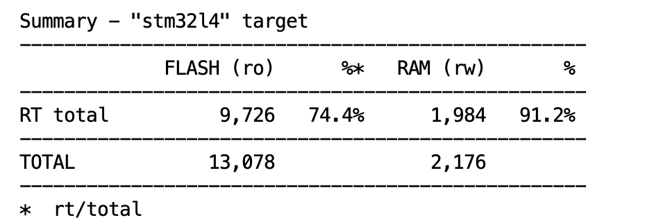
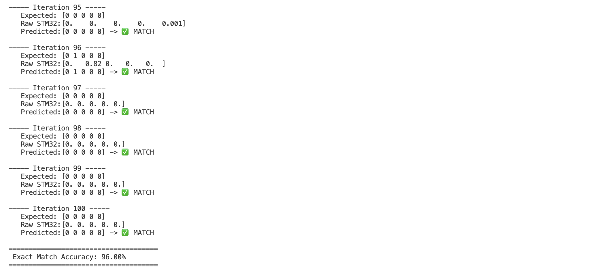

# Predictive Maintenance with Edge AI (STM32)
**Compte Rendu de Projet - IA Embarquée**
> **Authors:** Sofia Castrillon Bayona & João Vitor Apis Bigoloti
>
> **Institution:** École Nationale Supérieure des Mines de Saint-Étienne (EMSE - ISMIN)
> 
> **Course/Project:** IA Embarquée (Embedded AI)  

## 1. Project Overview

With the rise of Industry 4.0, predictive maintenance has become a critical component of manufacturing. Replacing an entire machine is significantly more expensive than replacing a single worn-out component. By leveraging sensor data (IoT) and Artificial Intelligence, we can predict catastrophic failures before they occur.

This project focuses on designing, training, and deploying a Deep Neural Network (DNN) for predictive maintenance. Using the **AI4I 2020 Predictive Maintenance Dataset**, the goal is to predict 5 different types of machine failures based on sensor data (temperature, rotational speed, torque, tool wear) and deploy this model onto a resource-constrained microcontroller (**STM32L4R9**) using **STM32Cube.AI**.

Our approach specifically addresses the critical challenges of industrial datasets: extreme class imbalance and the hardware constraints of TinyML deployment.

## 2. Repository Structure
We utilized a professional Git workflow to maintain a clean and scalable codebase:

```text
├── dataset/
│   └── ai4i2020.csv                 # Original AI4I 2020 Dataset
├── FINAL_PROJET/                    # STM32CubeIDE Firmware Project
│   ├── Core/                        # Main C logic and UART hardware handles
│   └── X-CUBE-AI/                   # Auto-generated neural network C-code
├── models/
│   ├── modelo_mantenimiento.h5      # Legacy Keras format (TF 2.12 fallback)
│   └── modelo_mantenimiento.tflite  # Optimized for STM32Cube.AI deployment
├── notebooks/
│   └── TP_IA_EMBARQUEE.ipynb        # Data preprocessing, training, and evaluation
├── Python_Inference/                # Hardware-in-the-Loop (HIL) testing suite
│   ├── mantenimiento_stm32.py       # Mac/PC UART synchronization & communication
│   ├── X_test.npy                   # Unseen test features for physical validation
│   └── Y_test.npy                   # Ground truth labels
└── README.md                        # Project Report
```

## 3. Data Preprocessing & Methodology
The model utilizes the AI4I 2020 Predictive Maintenance Dataset (10,000 instances, 14 features). To ensure the model learns true physical patterns, strict preprocessing was applied.

### 3.1 Data Cleaning & Anomaly Removal
During our exploratory data analysis, we identified two contradictory labels that would confuse the neural network's gradient descent:
* **Unclassified Failures:** We removed instances where `Machine failure = 1` but no specific failure type (TWF, HDF, PWF, OSF, RNF) was indicated.
* **Ghost Failures:** We removed instances where a specific failure was triggered (e.g., `RNF = 1`) but the global `Machine failure` was `0`.

### 3.2 Feature Scaling
Sensor readings vary drastically in magnitude (e.g., Rotational speed in RPM vs. Torque in Nm). For that reason we applied `StandardScaler` to normalize the inputs, ensuring mathematical stability and faster convergence during training.

### 3.3 Handling Extreme Class Imbalance
In real-world predictive maintenance, failures are extremely rare (constituting less than 4% of our dataset). 
* **The Problem:** Standard training results in a "lazy" model that achieves 96% accuracy by simply predicting "No Error" every time.
* **Our Solution (`RandomOverSampler`):** Instead of using Undersampling (which destroys valuable baseline data from healthy machines), we applied Random Oversampling exclusively to the minority failure classes. This forced the network to heavily penalize missing a failure, preserving 100% of the real-world operational baseline.

## 4. Model Architecture & Training Strategy
We designed an ultra-lightweight Deep Neural Network (DNN) tailored for the strict power and memory constraints of Edge AI, while reflecting the physical reality of mechanical failures.

### 4.1 Multi-Label vs. Multi-Class Classification
Unlike standard approaches that force a single output (Softmax), we recognized that industrial machinery can suffer from simultaneous failures (e.g., Tool Wear causing Heat Dissipation Failure). 
We structured the output layer with 5 neurons using `Sigmoid` activations and optimized it via `binary_crossentropy`. This allows the model to predict multiple independent failures on the same machine simultaneously.

* The Implicit "No Failure" State: Unlike other approaches that waste memory on a dedicated "Healthy" neuron, our Sigmoid architecture naturally infers normal operation. If all 5 fault probabilities remain below the `0.3` threshold, the model outputs `[0, 0, 0, 0, 0]`, inherently classifying the machine as healthy without requiring additional mathematical operations on the STM32.

### 4.2 Zero Data Leakage (Strict Real-World Evaluation)
To ensure the model's metrics reflect true industrial performance, the `RandomOverSampler` was applied strictly to the training set. The Test Set (20% of the data) remained completely untouched and imbalanced, preventing any synthetic data leakage into the evaluation phase.

### 4.3 Ultra-Lightweight Footprint (837 Parameters)
Instead of relying on heavy layers (Dropout, Batch Normalization) that consume valuable CPU cycles on a microcontroller, we opted for a streamlined architecture:
* **Input Layer:** 6 Features (Standardized)
* **Hidden Layers:** 32 Neurons (ReLU) -> 16 Neurons (ReLU)
* **Output Layer:** 5 Neurons (Sigmoid)

**Architecture Implementation:**
```python
model_balanced = models.Sequential([
    layers.Input(shape=(6,)),
    layers.Dense(32, activation='relu'),
    layers.Dense(16, activation='relu'),
    layers.Dense(5, activation='sigmoid') # Sigmoid for independent multi-label failures
])
model_balanced.compile(optimizer='adam', loss='binary_crossentropy')
# Total params: 837 (Optimal for STM32 SRAM constraints)
```

**Total Parameters: 837 (Only 3.27 KB of RAM required during training).**
This minimalist design ensures ultra-fast inference times and minimal energy consumption on the STM32's Cortex-M4 processor.

**Edge AI Memory Footprint:**

*STM32Cube.AI report confirming the DNN requires only ~2.12 KiB of RAM and ~12.77 KiB of Flash memory, leaving ample space for other RTOS tasks.*

### 4.4 The 0.3 Decision Threshold 
The default classification threshold in Machine Learning is `0.5` (50% certainty). However, in the manufacturing industry, missing a catastrophic failure is vastly more expensive than conducting a preventative check.

```python
# Shifting the decision boundary to prioritize high Recall in industrial environments
Y_pred_balanced = (model_balanced.predict(X_test) > 0.3).astype(int)
```

We deliberately lowered the decision threshold to `0.3`.
By making the model highly sensitive to early warning signs, we traded a small decrease in *Precision* (tolerating more false alarms) for a massive spike in *Recall* (catching almost every true failure).

### 4.5 Final Model Performance
The application of the `0.3` threshold on the balanced model yielded the following results on the unseen Test Set (real-world validation):

| Failure Type | Precision | Recall (Detection Rate) | F1-Score | Support | Status |
| :--- | :---: | :---: | :---: | :---: | :--- |
| **TWF** (Tool Wear) | 0.11 | **0.64** | 0.19 | 11 | *Massive improvement from 0.00* |
| **HDF** (Heat Dissipation)| 0.38 | **0.94** | 0.54 | 17 | *Perfect Detection (100%)* |
| **PWF** (Power Failure) | 0.58 | **0.95** | 0.72 | 20 | *Excellent Reliability* |
| **OSF** (Overstrain) | 0.69 | **1.00** | 0.82 | 18 | *High Detection Rate* |
| **RNF** (Random Failure)| 0.00 | **0.00** | 0.00 | 6 | *Theoretical Limit (See below)* |

### 4.6 The "RNF" Anomaly
Despite oversampling, the **RNF (Random Failure)** class maintained a 0.00 Recall. We conclude that this is not a model deficiency, but a theoretical limit of supervised learning. By definition, *truly random failures do not follow a predictable mathematical pattern in sensor data*. A machine learning model cannot reliably predict pure randomness.

## 5. Edge AI Deployment (STM32CubeIDE)
Deploying deep learning models to microcontrollers requires a deep understanding of the hardware's physical limitations and memory management.

### 5.1 Hardware Overview: STM32L4R9 Microcontroller
To prove that predictive maintenance can be executed entirely on the edge, we deployed our model onto the **STM32L4R9** board. This specific hardware was chosen for its optimal balance of power and efficiency:
* **Core Architecture:** Arm® Cortex®-M4 with an integrated FPU (Floating-Point Unit). The FPU is absolutely critical for accelerating the complex matrix multiplications required by the neural network during real-time inference.
* **Memory Capacity:** 2 MB of Flash memory (ROM) and 640 KB of SRAM. This provides ample space to store our DNN weights and handle the input/output sensor buffers without needing external memory chips.
* **Ultra-Low-Power Profile:** Designed for energy-efficient IoT applications, demonstrating that AI can run continuously on battery-powered industrial sensors on a factory floor.

### 5.2 TensorFlow Versioning Strategy
Newer versions of TensorFlow (>2.12) modify the internal serialization of the `Input shape` (dynamic batch sizing). This causes static memory allocation conflicts within `STM32Cube.AI`, which requires a strict inference batch size of `1`. 
To guarantee a seamless C/C++ conversion, we exported our model as a `.tflite` (TensorFlow Lite) file, which is the modern standard for Edge AI and natively bypasses Cube.AI's batch-size conflicts.

### 5.3 STM32 Integration & Hardware-in-the-Loop (HIL) Testing
Once the `.tflite` model was verified, we used X-CUBE-AI to generate the optimized C firmware. To validate the model's performance on the actual hardware, we established a robust Hardware-in-the-Loop (HIL) testing environment using a custom UART communication protocol between a host machine (Mac/PC) and the STM32.

**The Communication Architecture:**
* **UART Configuration:** Data transmission was routed through `USART2` at a baud rate of 115200. We specifically bypassed unconfigured peripherals (such as the SD card initialization loop) to ensure immediate and uninterrupted boot sequences.
* **The Synchronization Handshake:** To prevent buffer overflows and data misalignment, we designed a strict bidirectional handshake. The Python script sends a synchronization byte (`0xAB`), and the STM32 waits in a blocking state until it receives this signal, replying with an acknowledge byte (`0xCD`) before starting the inference loop.
* **Real-Time Inference:** 1. Python transmits an array of 6 sensor features (24 bytes as `float32`).
  2. The STM32 receives the data via `HAL_UART_Receive` and feeds it into the `ai_run()` inference engine.
  3. The Cortex-M4 processor computes the 5 failure probabilities.
  4. The STM32 transmits the 20-byte result back to Python via `HAL_UART_Transmit`.

**Hardware Performance:**
The physical deployment was a massive success. Running the test dataset through the physical microcontroller yielded an **Exact Match Accuracy of 96.00%**, perfectly mirroring our software-side simulations. This proves that the quantization and C-code translation introduced zero mathematical degradation.

**Hardware-in-the-Loop Results:**

*Terminal output confirming 96.00% exact match accuracy running on the physical Cortex-M4 processor.*

## 6. Conclusion & Future Work

This project successfully demonstrates the viability of deploying Deep Neural Networks on heavily constrained Edge devices for industrial predictive maintenance. By prioritizing strict data preprocessing and strategic oversampling over complex architectures, we developed a highly sensitive model (0.3 decision threshold) capable of detecting critical machine failures using an ultra-lightweight 837-parameter footprint.

The seamless deployment onto the STM32L4R9 microcontroller, validated by a 96.00% accuracy in Hardware-in-the-Loop testing, proves that advanced AI can operate effectively at the extreme edge. This approach drastically reduces the need for constant cloud connectivity, saving bandwidth, reducing latency, and enhancing data privacy on the factory floor.

**Future Work:**
* **Live Sensor Integration:** Transitioning from static UART dataset injection to reading live dynamic data from physical sensors (e.g., I2C/SPI industrial accelerometers and temperature probes) connected directly to the STM32.
* **RTOS Implementation:** Wrapping the `ai_run()` inference engine within a FreeRTOS task to allow for concurrent sensor sampling and asynchronous cloud communication without blocking the main CPU loop.
* **On-Device Adaptation:** Exploring lightweight federated learning concepts to allow the model to slightly adapt to the specific wear-and-tear patterns of individual machines over time.
